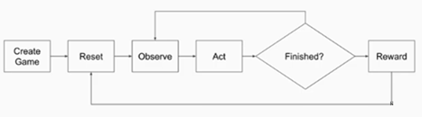

# DEEP REINFORCEMENT LEARNING FOR STARCRAFT II
### MOTIVATION
Although I will cover the technical aspects of reinforcement learning (RL) as an artificial intelligence technique, I must acknowledge that I was first introduced to the ‘reinforcement learning’ idea when I was learning how to train my dog 15 years ago. This activity eventually became my hobby, and when I found the same idea on the AI literature, I immediately focused my attention on the topic. ‘An agent interacting with the environment by trial/error and getting feedback? my dogs!’ I thought. In addition, it has potential applications  in robotics, healthcare, and education. I also believe that advancing the knowledge in RL is a fundamental task for AI as it is closely related with the concept of general intelligence which involves good decision/action making. For many years, the RL techniques and applications were restricted to small-scale problems. Fortunately, during the last few years deep learning techniques have allowed reinforcement learning to tackle large scale applications including task that are difficult to learn for humans. I had a strong motivation to learn those techniques because I am aware of the importance they will have in future years. Let me drive you through my learning path on deep reinforcement learning, one that shifted my hobby from training dogs to training bots.

### GOALS
- Implement the a DQN agent that learns how to play StarCraftII
- Document my learning approach of Deep Reinforcemt Learning to share with the community.

### ABSTRACT
This project was built over part of the concepts learnt on the courses Artificial Intelligence, Machine Learning, and Deep Learning:  Reinforcement Learning and Neural Networks. 

John McCarthy, one of the founders of Artificial Intelligence, referred to chess as the “The Drosophila of AI”, which can be understood as: “Games are to Artificial Intelligence what fruit flies are to genetics.” Games allow AI scientists to compare algorithms and set baselines for performance. The AI community continuously implement new learning environments to play those games in computers.  
The initial work in this work used the environment (GridWorld)[ https://github.com/Boty22/TD-0-and-Sarsa-for-Pac-Man-and-Grid-World] and focused in Reinforcement Learning. The classical methods of reinforcement learning, such as Q-learning and SARSA, store the values of in a table. This is enough for environments where the sets of actions and states are small enough for a computer, and those algorithms were implemented for the GridWorld. In the case of StarCraft II, it is not practical or possible to store all the values, so we need to approximate them. Machine learning offers tool to approximate functions such as Logistic Regression, Support Vector Regression, Neural Networks and others. 

The second part of the project (presented in this repo) updated and added units and features to the repository by (Chris Hoyean)[ https://github.com/chris-chris/pysc2-examples]. Here I  use of deep neural networks architectures as function approximation for reinforcement learning in addition to a buffer replay. The implementation used the open source environment for Starcraft II, developed by Blizzard and Deepmind. I also used the OpenAI baselines, and Tensorflow.

# PART I: REINFORCEMENT LEARNING
Reinforcement learning (RL) is the artificial intelligence framework that designs intelligent agents to perform sequential decision making by modeling systems as a Marcov Decision Process (MDP) and finding its solution through interaction with the system. An MDP is defined by a set of states S, a set of actions A, a reward function R(s,a,s’), and optionally a transition function P(s’|s,a). In RL, an MDP defines the interaction between a learning agent and its environment. The goal of an RL agent is to find an optimal policy (mapping from states to actions) which will maximize the expected sum of rewards. In addition, this reward might be delayed or be dependent on the time. Therefore, and early decision might have consequences later. In the search for an optimal policy, the agent has balance between the exploration of new states or the exploitation of what it already knows. 

Now we focus the attention on how to solve the MDP. If we have the model (transition and reward function), we can use Dynamic programing algorithms such as Policy iteration and Value Iteration to find the exact solution. However, they are not considered RL methods because they do not interact with the environment. When no model is provided, we have two options. First, Monte Carlo Methods (MC) that build on the idea of averaging the return of samples of episodes (sequence of states must have initial state and last state). They learn from complete episodes (do not bootstrap). Second, Temporal Difference Learning (TD), which learn (update values) after each action is taken using the difference between the current value and an estimation of a later value. Therefore, TD methods do not need to complete episodes and can bootstrap. Sarsa and Q-learning are TD methods. MC and TD methods are tabular methods because they store the approximation of the value in a table. However, when the state space and action space are too large, we do not only need more memory to store the values but also, we need more data (samples). As huge memory or data  are infeasible, we need generalization from the data available. It is here where the methods used in supervised learning can help because they are successful functions approximation. 
### RECOMMENDED READINGS:
[1] Richard S. Sutton and Andrew G. Barto. Reinforcement learning: an introduction The MIT Press, 2018:
-	Chapter 3: Finite Markov Decision Processes 
-	Chapter 4: Dynamic Programming
-	Chapter 5: Monte Carlo Methods
-	Chapter 6: Temporal-Difference Learning
-	Chapter 9: On-policy Prediction with Approximation
-	Chapter 16: Applications and Case Studies

[2] Thomas G. Dietterich and Xin Wang. Batch Value Function Approximation via Support Vectors. Advances in Neural Information Processing Systems 14 (NIPS 2001)

[3] Xin Wang and Thomas G. Dietterich. Efficient Value Function Approximation Using Regression Trees. In Proceedings of the IJCAI Workshop on Statistical Machine Learning for Large-Scale Optimization, 1999
### TUTORIALS:
[4] Deep Reinforcement Learning, Decision Making, and Control. ICML 2017 Tutorial. https://sites.google.com/view/icml17deeprl
### OPEN SOURCE:
[5] Project 3: Reinforcement Learning. http://ai.berkeley.edu/reinforcement.html
### PROGRAMS IMPLEMENTED:
(1) TD-0 for Grid-World 

(2) Sarsa for Grid-World

(3) Q-learning algorithms for Grid-World
 
# PART 2: DEEP REINFORCEMENT LEARNING
The theory available for reinforcement learning had constrained to applications with fully observed, low-dimensional state spaces. Starting 2010, neural networks using the power of computing such as GPUs and data availability as ImageNet, increased their accuracy and ability to manage high-dimensional data. The new set of methods for neural networks were coined under the name of Deep Learning. Reinforcement Learning research had already used neural networks, however those methods had already a high computational cost and were considered inefficient when using large neural large networks<sup>6</sup>. For example, Neural Fitted Q-iteration (NFQ)<sup>7</sup> modified the classical Q-Learning (where the update is performed online in a sample by sample manner) to an off-line version. In an NFQ iteration, a neural network Q<sub>k</sub> generates a complete set of new samples, then a new neural network Q<sub>k+1</sub> is trained using those samples, resulting in a fitted Q-Iteration algorithm (special form of experience replay)<sup>3</sup> where the regression algorithm uses a neural net. As mentioned before, the high computational cost of training a deep neural network in each iteration would would make its use too inefficient. In addition, a neural network as a function approximation was considered unstable because of the correlation between successive updates and the correlation between current value of the Q and the target. The application of reinforcement learning in rich perceptual domains had to wait a little bit more. 

One of the earliest successful applications of deep learning to reinforcement learning was in the Atari game. The architecture designed was named Deep Q Network (DQN)<sup>6</sup> . It used a convolutional neural network of two convolutional layers and two fully connected layers. We can consider DQN as an evolution of NFQ in the sense that it used experience replay to address the correlation between successive updates. However, DQN is online, it samples a random minibatch of transitions from the replay buffer and preforms gradient descent to update the Q network. The use of the reply experience made DQN off-policy. DQN also addressed the correlation between the value and the target by using a separated network (older set of weights) to compute the targets that is updated every x number of iterations; therefore, the target function does not change too quickly. The results of DQN were impressive, it outperformed human payers in 29 of 49 games using the same architecture and hyperparameters. It only had to retrain for a new neural net for each game. Despite the unprecedented success, DQN had some drawbacks: its use of memory and the requirement of off-policy learning. The asynchronous advantage actor-critic (A3C)<sup>11</sup> method surpasses these drawbacks by asynchronously executing multiple agents in parallel, on multiple instances of the environment threads of the same CPU. The agents share a model which asynchronously updated in the shared memory, and they might employ different exploration policies. AC3 tis less expensive to train that DQN, but it might be less stable too.  

As dataset such ImageNet allowed the flourishment of techniques for deep neural networks, challenging reinforcement learning environments are allowing the development of new reinforcement learning methods<sup>10</sup>. Some examples of environment are Atari, Go, Dota and StarCraft II. For this course, we selected the StarCraft II RL environment. StarCraft is a real time strategy game (RTS) considered a highly complex domain. Depending on the map (challenge) we use, the units available and resources, the player decides what actions to take. See the Strategy for the Implementation section or more details.

### RECOMMENDED READINGS:
[6] Volodymyr Mnih, Koray Kavukcuoglu, David Silver, Andrei A Rusu, Joel Veness, Marc G Bellemare, Alex Graves, Martin Riedmiller, Andreas K Fidjeland, Georg Ostrovski, et al. Human-level control through deep reinforcement learning. Nature, 518(7540):529–533, 2015.

[7] Martin Riedmiller. Neural Fitted Q Iteration - First Experiences with a Data Efficient Neural Reinforcement Learning Method. Machine Learning: ECML 3720, 317-328 (Springer, 2005)

[8] D. Ernst and and L. Wehenkel P. Geurts. Tree-based batch mode reinforcement learning. Journal of Machine Learning Research, 6:503–556, 2005

[9] David Silver, Aja Huang, Chris J Maddison, Arthur Guez, Laurent Sifre, George Van Den Driessche, Julian Schrittwieser, Ioannis Antonoglou, Veda Panneershelvam, Marc Lanc- tot, et al. Mastering the game of Go with deep neural networks and tree search. Nature, 529 (7587):484–489, 2016.

[10] Vinyals, O., Ewalds, T., Bartunov, S., Georgiev, P., Vezhnevets, A. S., Yeo, M.,  Tsing, R. (2017). StarCraft II: A New Challenge for Reinforcement Learning. https://doi.org/https://deepmind.com/documents/110/sc2le.pdf

[11] Mnih, Volodymyr, Kavukcuoglu, Koray, Silver, David, Graves, Alex, Antonoglou, Ioannis, Wierstra, Daan, and Riedmiller, Martin. Playing atari with deep reinforcement learning. In NIPS Deep Learning Workshop. 2013.

[12] Volodymyr Mnih, Adrià Puigdomènech Badia, Mehdi Mirza, Alex Graves, Timothy P. Lillicrap, Tim Harley, David Silver, Koray Kavukcuoglu. Asynchronous Methods for Deep Reinforcement Learning. ICML 2016.

[13] Basel Alghanem, Keerthana P G. Asynchronous Advantage Actor-Critic Agent for Starcraft II. arXiv:1807.08217
### TUTORIALS:
[15] Advanced Deep Learning & Reinforcement Learning.  https://www.youtube.com/playlist?list=PLqYmG7hTraZDNJre23vqCGIVpfZ_K2RZs

[16] Deep RL Bootcamp 2017. https://www.youtube.com/playlist?list=PLAdk-EyP1ND8MqJEJnSvaoUShrAWYe51U
### OPEN SOURCE:
[17] Baselines. https://github.com/openai/baselines

[18] Baselines.deepq.experiments. https://github.com/openai/baselines/tree/master/baselines/deepq/experiments

[19] Steven Brown. Build a Zerg Bot with PySC2 2.0. https://itnext.io/build-a-zerg-bot-with-pysc2-2-0-295375d2f58e

[20] Chris Hoyean Song. StarCraft II RL Tutorial 1 http://chris-chris.ai/2017/08/30/pysc2-tutorial1/
### PROGRAMS IMPLEMENTED:
(4) terran_bot.py
Scripted bot that uses "Simple64" map and plays against Zerg race. Based on [19]

(5) terran_bot_cms.py
Scripted bot that uses " CollectMineralShards" map and plays against Zerg race.

(6) terran_bot_dr.py
Scripted bot that uses " DefeatRoaches" map and plays against Zerg race.

(7) terran_bot_mtb.py
Scripted bot that uses "MoveToBeacon" map and plays against Zerg race.

(8) train_mineral_shards.py
Program that trains two marines in the “CollectMineralShards” map to collect as much shards as possible.  based on [18] and [20], which were not working in the original repository.  

(9) deepq_mineral_shards.py
Program that trains a using a program based on [18] and [20]

## STRATEGY FOR THE IMPLEMENTATION:
The firs step to tackle the problem was familiarizing with the StarCraftII domain (learn how to play the game). I learnt that:
- The game has three types of race. Each race has its own units and each unit its own set of possible actions
- Is a multiagent problem, where agents are competing.
- It is an imperfect information game
- The action space is vast and diverse with many actions available
-	Delayed reward knowledge

The second step was familiarizing with the pysc2 Reinforcement Learning environment. To do so, I created some scripted bots. Using the minimaps and complete ones. Minimaps are maps specially developed for ML experimentation, which will be used later.

I can summarize the pysc2 environment with the following picture:

 
The most important blocks are Observe and Act. In observe we have two options: the first is to use the RGB input as in Atari, and the second the feature layers. In this project I’m using feature layers. The knowledge of the variables and their semantics ( the meaning of each layer in a tensor) is crucial for debugging purposes. The Act block will allow allow the agent to a selected action. 
The third step was providing reinforcement learning algorithms to the bots. In this case I trained a dqn.  
 
# THE CODE

This example program was built on 
- (Deepmind) [https://github.com/deepmind/pysc2]
- baselines (OpenAI) [https://github.com/openai/baselines]
- s2client-proto (Blizzard) [https://github.com/Blizzard/s2client-proto]
- Tensorflow 1.3 (Google) [https://github.com/tensorflow/tensorflow]

## Current examples

### Minimaps
- CollectMineralShards with Deep Q Network


## Quick Start Guide

### 1. Get PySC2

#### PyPI

The easiest way to get PySC2 is to use pip:

```shell
$ pip install git+https://github.com/deepmind/pysc2
```

Also, you have to install `baselines` library.

```shell
$ pip install git+https://github.com/openai/baselines
```

### 2. Install StarCraft II

#### Mac / Win

You have to purchase StarCraft II and install it. Or even the Starter Edition will work.

http://us.battle.net/sc2/en/legacy-of-the-void/

#### Linux Packages

Follow Blizzard's [documentation](https://github.com/Blizzard/s2client-proto#downloads) to
get the linux version. By default, PySC2 expects the game to live in
`~/StarCraftII/`.

* [3.16.1](http://blzdistsc2-a.akamaihd.net/Linux/SC2.3.16.1.zip)

### 3. Download Maps

Download the [ladder maps](https://github.com/Blizzard/s2client-proto#downloads)
and the [mini games](https://github.com/deepmind/pysc2/releases/download/v1.2/mini_games.zip)
and extract them to your `StarcraftII/Maps/` directory.

### 4. Try the scripted bots
```shell
$ python terran_bot.py
```

### 5. Train an agent!

```shell
$ python train_mineral_shards.py --algorithm=deepq
```
